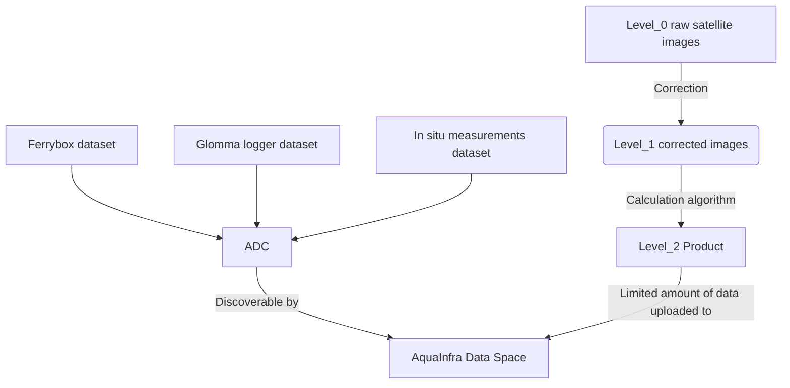
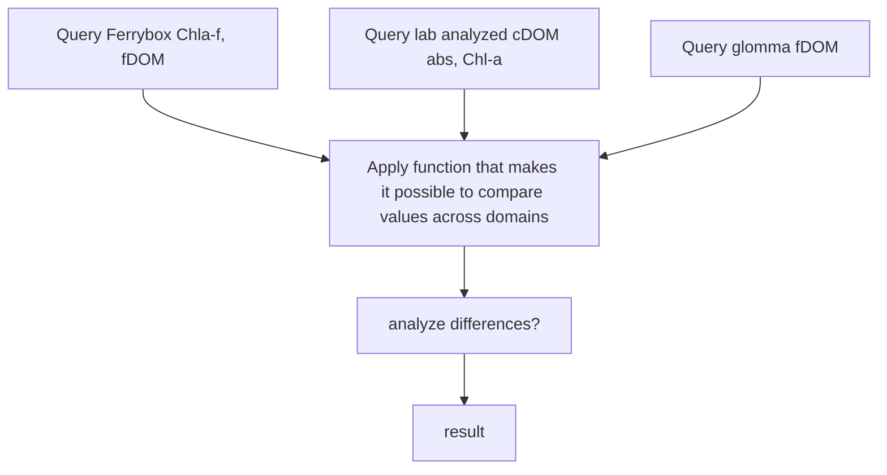

# aquainfra
Jupyter Notebooks for Oslo Fjord use cases, Aquainfra project 

### General data flow, to be agreed

### Use Cases data flow 
##### Example
* Research question: ? 
* Parameters that will be analyzed to answer the question: Chl-a, cDOM (example)
* Jupyter Notebook for this question: ?

