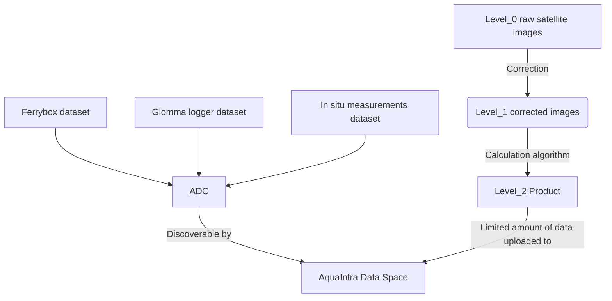
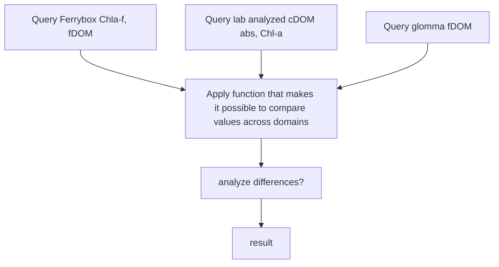

# aquainfra

Jupyter Notebooks for Oslo Fjord use cases, Aquainfra project 

### General data flow, to be agreed

### Use Cases data flow 
##### Example
* Research question: ? 
* Parameters that will be analyzed to answer the question: Chl-a, cDOM (example)
* Jupyter Notebook for this question: ?

### River data to do list

1. Discharge data (Leah)
  * Share python script for extracting the NVE data
  * Get NVE data for the three rivers 

2. Water chemistry grab samples (Areti)
  * Get from Aquamonitor & Vannmiljø. Same?
  * Make generic, shareable script to clean the data if necessary

3. Glomma sensor data
   * Data retrieved using app and saved (Leah done)
   * Ivana? Make script to access and QC data. Improve on existing QC routines (with Leah/Øyvind K)
   * Leah/Areti: Check sensor data

4. Regressions (Leah/Areti)
  * Concentration vs sensor: FDOM-DOC, Turb-SPM, Conductivity-NO3, ...?
  * Concentration vs discharge
  * Seasonally-variable regressions?

5. Estimate daily concentrations (Leah/Areti)
  - Interpolation
  - Stats relationships from regressions

6. Estimate daily loads (Leah/Areti)
   - Freshwater, DOC, SPM, NO3, TN, TP, ...?
